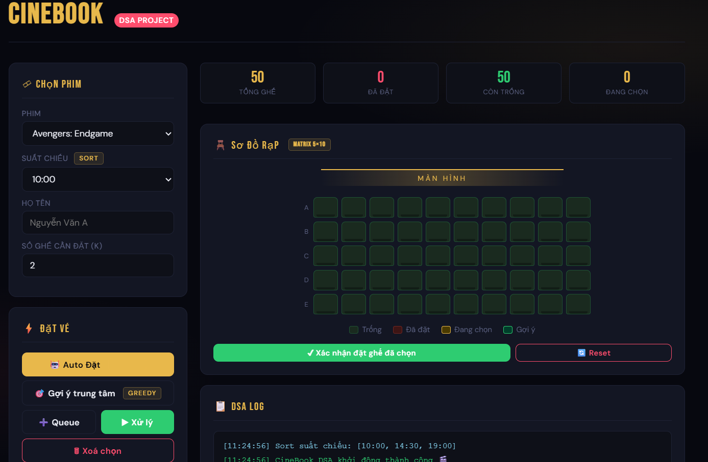

# 🎬 CineBook DSA

## 📌 Giới thiệu
**CineBook DSA** là ứng dụng mô phỏng hệ thống đặt vé rạp chiếu phim, được xây dựng bằng **HTML, CSS, JavaScript thuần**.

Dự án tập trung vào việc áp dụng các **thuật toán và cấu trúc dữ liệu (DSA)** vào bài toán thực tế như:
- Tìm ghế
- Đặt vé tự động
- Quản lý hàng đợi
- Tìm kiếm nhanh

---

## 🚀 Tính năng chính

### 🎞 Quản lý phim & suất chiếu
- Chọn phim và suất chiếu
- Sắp xếp suất chiếu theo thời gian (**Sort**)

### 🪑 Sơ đồ ghế (Matrix 5×10)
- Hiển thị 50 ghế dạng ma trận
- Trạng thái:
  - Ghế trống
  - Ghế đã đặt
  - Ghế đang chọn
  - Ghế được gợi ý

### 🤖 Auto Booking (Greedy)
- Tự động tìm **k ghế liền nhau**
- Nếu không có → gợi ý ghế gần trung tâm nhất

### 🎯 Gợi ý ghế trung tâm (Greedy)
- Tìm vị trí tối ưu gần trung tâm rạp

### ➕ Queue (FIFO)
- Thêm yêu cầu đặt ghế vào hàng đợi
- Xử lý lần lượt theo nguyên tắc **First In First Out**

### 🔍 Tìm kiếm ghế (Binary Search)
- Tìm ghế trống đầu tiên từ một hàng bất kỳ
- Tối ưu số bước tìm kiếm

### 📋 DSA Log
- Hiển thị chi tiết quá trình chạy thuật toán

### 🎟 Lịch sử đặt vé
- Lưu thông tin người đặt, ghế, phim, thời gian
- Cho phép huỷ vé và hoàn lại ghế

---

## 🧠 Thuật toán & DSA áp dụng

| Chức năng | Thuật toán |
|----------|----------|
| Sắp xếp suất chiếu | Sort (String Compare) |
| Tìm ghế liền nhau | Sliding Window / Linear Scan |
| Chọn ghế tối ưu | Greedy |
| Xử lý yêu cầu | Queue (FIFO) |
| Tìm kiếm ghế | Binary Search |
| Lưu ghế | Matrix 2D (5×10) |

---

## 🛠 Công nghệ sử dụng
- HTML5
- CSS3 (UI hiện đại, responsive)
- JavaScript (Vanilla JS)
- LocalStorage (lưu dữ liệu)

---

## 📦 Cấu trúc dự án
CTDL_FINAL/
│── index.html # File chính (UI + logic)
│── README.md # Tài liệu dự án

---

## ▶️ Cách chạy dự án

### Cách 1: Mở trực tiếp
- Mở file `index.html` bằng trình duyệt

### Cách 2: Dùng Live Server (khuyến nghị)
- Mở bằng VS Code
- Cài extension **Live Server**
- Click chuột phải → `Open with Live Server`

---

## 💾 Lưu trữ dữ liệu
Dữ liệu được lưu bằng:
- `localStorage`
  - Ghế đã đặt
  - Lịch sử đặt vé

👉 Không cần database

---

## 📸 Demo (gợi ý)

---

## 📈 Hướng phát triển
- Thêm đăng nhập người dùng
- Kết nối database (MySQL, Firebase)
- Thanh toán online (VNPay, Momo)
- Backend (Node.js / Laravel)
- API booking

---

## 👨‍💻 Tác giả
- Sinh viên CNTT
- Dự án học phần **Data Structures & Algorithms**

---

## ⭐ Ghi chú
Dự án mang tính học tập, giúp hiểu cách áp dụng DSA vào hệ thống thực tế như:
- Booking system
- Resource allocation
- Queue processing

---

